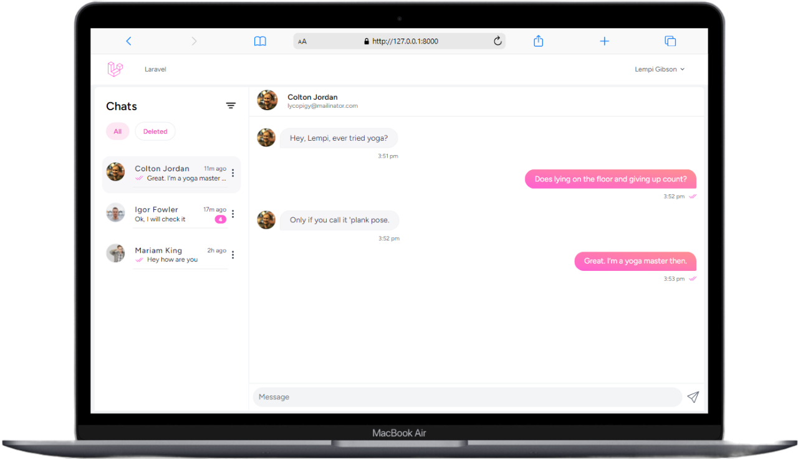

# Chat App with AI Feature (Work in Progress)

This is a real-time chat application built using the TALL stack (Tailwind CSS, Alpine.js, Laravel, and Livewire). The app allows users to send and receive messages instantly in a chat interface, with features like read receipts and message status tracking.

## Features
- **Real-time messaging:** Communicate instantly with other users.
- **Read receipts:** See when your messages have been read.
- **Message status tracking:** View the status of sent and received messages.

## Current progress (screenshots) 
 
  

  
  
  

### Coming Soon
The app will also include an AI chat feature, allowing users to interact with a bot alongside other users in the same chat. This feature is currently under development and will be included in a future update.
